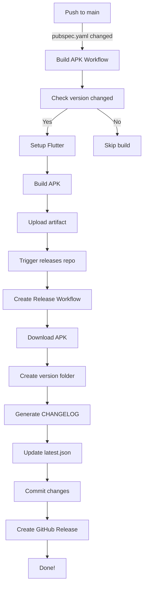

# GitHub Actions Automation Setup

## 🎯 Overview

Automated release process that triggers when you bump the version in `pubspec.yaml`.

**Process:**
1. Bump version in `frontend/pubspec.yaml`
2. Push to main
3. GitHub Actions automatically:
   - Builds APK
   - Uploads to releases repo
   - Updates `latest.json`
   - Creates GitHub Release

---

## 🔐 Required GitHub Secrets

### Main Repo (coffee-pos-saas)

Go to: https://github.com/mr-usely/coffee-pos-saas/settings/secrets/actions

**Secret Name:** `RELEASES_REPO_TOKEN`  
**Value:** Your GitHub Personal Access Token (the same one you created earlier)  
**Scope:** `repo` (full control of private repositories)

### Releases Repo (coffee-pos-releases)

Go to: https://github.com/mr-usely/coffee-pos-releases/settings/secrets/actions

**Secret Name:** `MAIN_REPO_TOKEN`  
**Value:** Your GitHub Personal Access Token (the same one)  
**Scope:** `repo` (full control of private repositories)

> **Note:** You can use the same token (`github_pat_11APT6ISQ0pStvPBPthOrz_...`) for both secrets!

---

## 📝 How to Add Secrets

1. Go to repository → Settings → Secrets and variables → Actions
2. Click "New repository secret"
3. Name: `RELEASES_REPO_TOKEN` (or `MAIN_REPO_TOKEN`)
4. Value: Paste your GitHub token
5. Click "Add secret"

---

## 🚀 Testing the Automation

### Test 1: Trigger Build

1. Edit `frontend/pubspec.yaml`:
   ```yaml
   version: 1.0.0+8  # Bump from +7 to +8
   ```

2. Commit and push:
   ```bash
   git add frontend/pubspec.yaml
   git commit -m "Bump version to 1.0.0+8"
   git push origin main
   ```

3. Watch the workflow:
   - Go to: https://github.com/mr-usely/coffee-pos-saas/actions
   - Should see "Build and Release APK" workflow running
   - Check logs for build progress

### Test 2: Verify Release Creation

1. After build completes, check releases repo:
   - Go to: https://github.com/mr-usely/coffee-pos-releases/actions
   - Should see "Create Release" workflow running

2. Verify outputs:
   - `latest.json` updated with version 1.0.0+8
   - New folder: `releases/1.0.0+8/`
   - GitHub Release created: https://github.com/mr-usely/coffee-pos-releases/releases

### Test 3: Test Auto-Updater

1. Install old version (1.0.0+7) on device
2. Open app
3. Should prompt to update to 1.0.0+8
4. Click "Update Now"
5. APK downloads and installs

---

## 🔍 Troubleshooting

### Workflow doesn't trigger

- **Check:** Did you push to `main` branch?
- **Check:** Did `frontend/pubspec.yaml` actually change?
- **Check:** Is the workflow file in `.github/workflows/`?

### Build fails

- **Check logs** in GitHub Actions tab
- Common issues:
  - Flutter version mismatch
  - Missing dependencies
  - Build errors in code

### Release creation fails

- **Check:** Is `MAIN_REPO_TOKEN` secret set correctly?
- **Check:** Does token have `repo` scope?
- **Check:** Can the token access both repositories?

### APK download fails in app

- **Check:** Is `latest.json` updated correctly?
- **Check:** Is GitHub Release created with APK attached?
- **Check:** Is GitHub token in app still valid?

---

## 📊 Workflow Diagram



---

## 🎉 Benefits

- ✅ No manual APK building
- ✅ No manual file copying
- ✅ No manual `latest.json` updates
- ✅ No manual GitHub Release creation
- ✅ Consistent release process
- ✅ Automatic changelog generation
- ✅ Version history tracking

---

## 🔄 Future Enhancements

- [ ] Add automated testing before release
- [ ] Support beta/alpha channels
- [ ] Add manual approval gate
- [ ] Generate changelog from git commits
- [ ] Send notifications (Slack/Discord)
- [ ] Validate APK signature
